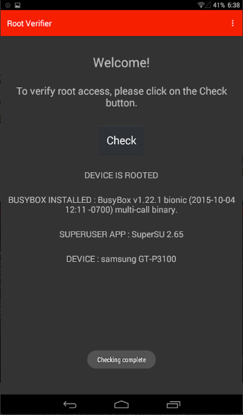

# Verifique se o telefone está enraizado

## O que é "root"?

"root" é uma conta de superusuário do sistema em todos os sistemas Android (na verdade, todos os sistemas operacionais do tipo UNIX, incluindo Linux, macOS e iOS). O usuário root tem permissão para fazer qualquer coisa no sistema. Normalmente, apenas alguns (mas não todos) processos do sistema são executados como root. Os aplicativos do usuário nunca são executados como root, mas em contas menos privilegiadas (normais).

Às vezes, os usuários desejam personalizar o sistema de uma forma não permitida para contas normais, como remover os aplicativos integrados instalados pelo fornecedor ("bloatware") para liberar espaço de armazenamento. Nesse caso, os usuários precisam "enraizar" seu sistema, o que significa obter controle direto da conta "root" no sistema.

O enraizamento geralmente envolve:

1. Desbloquear o bootloader do dispositivo.
2. Atualizar um "sistema operacional de recuperação" personalizado (geralmente chamado apenas de "recuperação"), que é um sistema operacional mínimo que vive em uma partição de armazenamento separada. O propósito original da recuperação é instalar atualizações do sistema.
3. Usando a recuperação personalizada, atualize (instale) o pacote root.

No processo de root, recursos importantes de segurança do sistema são desabilitados (como desbloqueio do bootloader). Um sistema rooteado também adiciona mais vetores de ataque ao sistema.

## Procure por aplicativos relacionados ao root

Quando um telefone é rooteado, o processo geralmente envolve a instalação de um aplicativo para gerenciar o acesso root, na maioria das vezes [Magisk](https://github.com/topjohnwu/Magisk) (ou [SuperSU](http://www.supersu.com/) em versões antigas do Android). Um primeiro passo é verificar se o aplicativo Magisk está instalado. Você pode verificar diretamente o ícone no seu menu principal ou ir para **Configurações > Aplicativos** e pesquisar o aplicativo.

## Verifique com o Root Verifier

O Root Verifier é um aplicativo [de código aberto](https://github.com/abcdjdj/RootVerifier-APP) que verifica se um telefone Android está rooteado por meio de diferentes técnicas. Você pode instalá-lo na [Google Play Store](https://play.google.com/store/apps/details?id=com.abcdjdj.rootverifier) ​​ou no [repositório F-Droid](https://f-droid.org/packages/com.abcdjdj.rootverifier/).

Depois de instalado, você pode iniciar o aplicativo. A interface é muito simples, você só precisa clicar em "CHECK" e aguardar o resultado.

 
