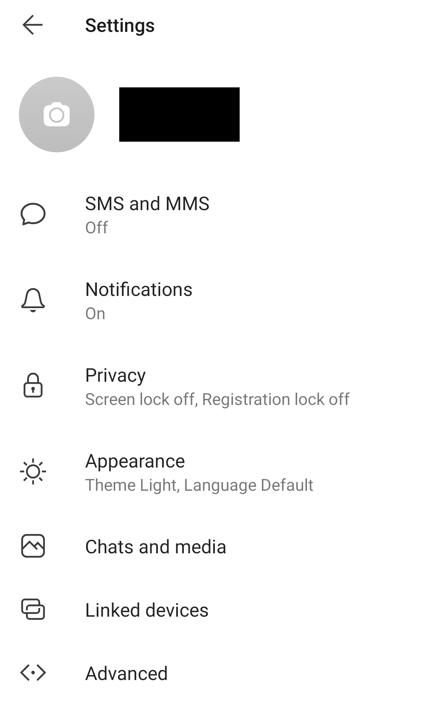

# Check Devices Linked to Chat Applications

Many chat applications allow to link another device to the account in order to read and send messages from a computer. It is possible to use that feature to illegitimately get access to the account and messages exchanged by the application, it is thus interesting to check that there is no unknown session or linked devices.

## Signal

Go to the page "Linked Devices" in Parameters (`...` in the menu) > Settings. You will see a list of connected devices, you can tap on any unknown device in order to disconnect it.

 

## WhatsApp

Go to Parameters (`...` in the menu) and click on "WhatsApp Web".

You can see here all the web browsers connected to your WhatsApp account.

## Telegram

On your Telegram application, visit the page Settings > Privacy and Security > Active Sessions. This page shows you all the active sessions you have with your account, you can tap on any session to terminate it.

## Wire

On the Wire application, click on your profile and go to `Settings > Devices`. On this page, you can see all the sessions opened for your account, including smartphone applications, desktop applications and web sessions. You can click on any of these sessions and remove the device (you will need your password to do so).

